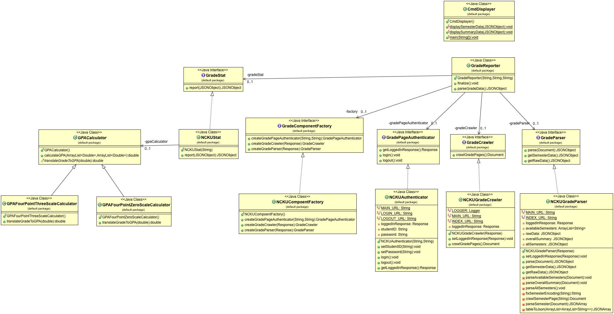
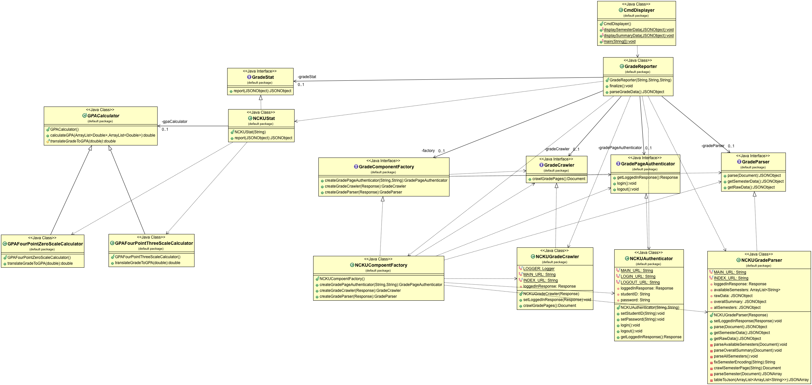

# Grade Reporter
Generate grade report and calculate GPA (Currently only supports NCKU)

## Prerequisite
- java
- gradle

## Build

```sh
gradle build
```

## Generate executables

```sh
gradle jar
```
The compressed files would locate at `build/distributions/`.  

Unzip it and execute the binary file using the following command.

```sh
./bin/GradeReporter
```

## Usage
Just enter your student ID and password, and you will get a full report of your grades in each semester (including your GPA).

Note that if you execute it from IDEs (e.g., eclipse or IntelliJ), your password will not be concealed.


## Class Diagram

### Without Relations



### With Relations



# AUTHORS
[Lee-W](https://github.com/Lee-W/)

# LICENSE
MIT
